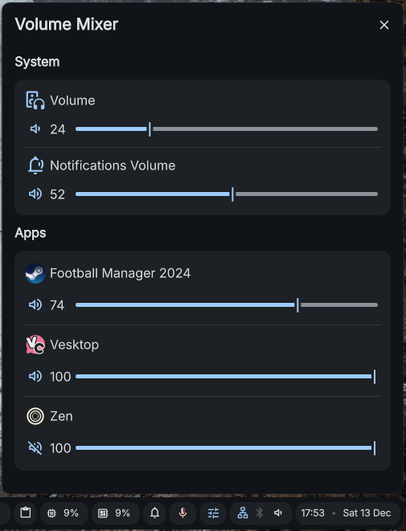

# Volume Mixer plugin for DMS

A plugin that allows you to control the volume of your system and applications.



## Features
* **System Volume Control:** Adjust the default main output volume
* **Notifications Volume Control:** Adjust the volume for system notifications (To enable this feature apply the manual steps [here](link-to-Control-Notifications-Volume))
* **Per-Application Mixing:** Independently control the volume level for every running application

## Installation

```bash
mkdir -p ~/.config/DankMaterialShell/plugins/
cd ~/.config/DankMaterialShell/plugins/
git clone https://github.com/EDUnter/dms-volume-mixer 
```

## Usage
1. Open DMS Settings
2. Go to the "Plugins" tab
3. Click on Scan
4. Enable the "Volume Mixer" plugin
5. Go to the "Widgets" tab
6. Add the "Volume Mixer" widget to your DankBar
7. Open the "Volume Mixer" widget to adjust the volume levels for your system and applications

## Known limitations
Brief, annoying audio spikes when the volume is changed directly within the application. The spikes are more noticeable when the volume factor is configured to a significantly low value.

> **What is the Volume Factor?**
> The **volume factor** is a multiplier applied to the audio stream's current volume, **directly corresponding to the value displayed on the widget's slider.**

## Control Notifications Volume
To control the notification volume, manual modification of a DMS file is currently required. An issue will be created to avoid these manual changes.
```
sudo nvim /usr/share/quickshell/dms/Services/AudioService.qml
```
```
# Add the properties `notificationsVolume` and `notificationsAudioMuted` just below `criticalNotificationSound` 
property var criticalNotificationSound: null
property real notificationsVolume: 1.0
property bool notificationsAudioMuted: false

# Replace `1.0` with `notificationsVolume`
volumeChangeSound = Qt.createQmlObject(`
                import QtQuick
                import QtMultimedia
                MediaPlayer {
                    source: "${volumeChangePath}"
                    audioOutput: AudioOutput {
                        ${deviceProperty}volume: notificationsVolume
                    }
                }
            `, root, "AudioService.VolumeChangeSound");

const powerPlugPath = getSoundPath("power-plug");
powerPlugSound = Qt.createQmlObject(`
    import QtQuick
    import QtMultimedia
    MediaPlayer {
        source: "${powerPlugPath}"
        audioOutput: AudioOutput {
            ${deviceProperty}volume: notificationsVolume
        }
    }
`, root, "AudioService.PowerPlugSound");

const powerUnplugPath = getSoundPath("power-unplug");
powerUnplugSound = Qt.createQmlObject(`
    import QtQuick
    import QtMultimedia
    MediaPlayer {
        source: "${powerUnplugPath}"
        audioOutput: AudioOutput {
            ${deviceProperty}volume: notificationsVolume
        }
    }
`, root, "AudioService.PowerUnplugSound");

const messagePath = getSoundPath("message");
normalNotificationSound = Qt.createQmlObject(`
    import QtQuick
    import QtMultimedia
    MediaPlayer {
        source: "${messagePath}"
        audioOutput: AudioOutput {
            ${deviceProperty}volume: notificationsVolume
        }
    }
`, root, "AudioService.NormalNotificationSound");

const messageNewInstantPath = getSoundPath("message-new-instant");
criticalNotificationSound = Qt.createQmlObject(`
    import QtQuick
    import QtMultimedia
    MediaPlayer {
        source: "${messageNewInstantPath}"
        audioOutput: AudioOutput {
            ${deviceProperty}volume: notificationsVolume
        }
    }
`, root, "AudioService.CriticalNotificationSound");

# Add to the condtition to play each sound `&& !notificationsAudioMuted`
function playVolumeChangeSound() {
    if (soundsAvailable && volumeChangeSound && !notificationsAudioMuted) {
        volumeChangeSound.play();
    }
}

function playPowerPlugSound() {
    if (soundsAvailable && powerPlugSound && !notificationsAudioMuted) {
        powerPlugSound.play();
    }
}

function playPowerUnplugSound() {
    if (soundsAvailable && powerUnplugSound && !notificationsAudioMuted) {
        powerUnplugSound.play();
    }
}

function playNormalNotificationSound() {
    if (soundsAvailable && normalNotificationSound && !SessionData.doNotDisturb && !notificationsAudioMuted) {
        normalNotificationSound.play();
    }
}

function playCriticalNotificationSound() {
    if (soundsAvailable && criticalNotificationSound && !SessionData.doNotDisturb && !notificationsAudioMuted) {
        criticalNotificationSound.play();
    }
}

function playVolumeChangeSoundIfEnabled() {
    if (SettingsData.soundsEnabled && SettingsData.soundVolumeChanged && !notificationsAudioMuted) {
        playVolumeChangeSound();
    }
}
```
After editing the file restart DMS
```
dms restart
```
